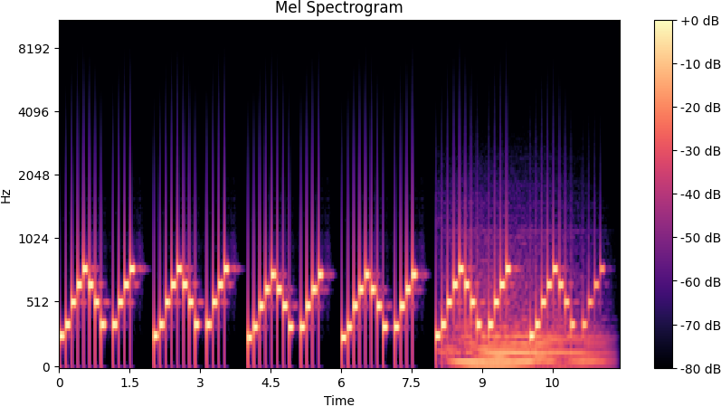

# Audio Side Channel Attack Senior Project

An implementation of an audio side channel attack based on the paper: <br>
[A Practical Deep Learning-Based Acoustic Side Channel Attack on Keyboards](https://arxiv.org/pdf/2308.01074)

<a name="readme-top"></a>

<div align="center">

[![Contributors][contributors-shield]][contributors-url]
[![Forks][forks-shield]][forks-url]
[![Stargazers][stars-shield]][stars-url]
[![Issues][issues-shield]][issues-url]

</div>
<br />
<div align="center">
  <a href="https://github.com/nsherm01/audioSideChannelAttack">
    
  </a>

  <h3 align="center">Audio Side Channel Attack</h3>

  <p align="center">
    An implementation of an audio side channel attack on a keyboard utalizing Librosa and PyTorch.
    <br />
    <a href="https://github.com/nsherm01/audioSideChannelAttack"><strong>Explore the docs »</strong></a>
    <br />
    <br />
    <a href="https://github.com/nsherm01/audioSideChannelAttack/issues/new?labels=bug&template=bug-report---.md">Report Bug</a>
    ·
    <a href="https://github.com/nsherm01/audioSideChannelAttack/issues/new?labels=enhancement&template=feature-request---.md">Request Feature</a>
  </p>
</div>


<!-- TABLE OF CONTENTS -->
<details>
  <summary>Table of Contents</summary>
  <ol>
    <li><a href="#about-the-project">About The Project</a></li>
    <li><a href="#built-with">Built With</a></li>
    <li><a href="#getting-started">Getting Started</a></li>
    <li><a href="#roadmap">Roadmap</a></li>
    <li><a href="#contact">Contact</a></li>
    <li><a href="#acknowledgments">Acknowledgments</a></li>
  </ol>
</details>


<!-- ABOUT THE PROJECT -->
## About The Project


This project was created for our senior project and implemented over the course of 2 quarters (about 5 months). The project is divided into several steps. The first involved taking in a audio file and parsing it to isolate each key press and exporting those as mel spectrograms (which map an audio files frequency and amplitude). We then were able to use those key presses along with labels to train a neural network named CoAtNet which was developed by the orignal paper.

<p align="right">(<a href="#readme-top">back to top</a>)</p>


## Built With

<h3><u>Librosa:</u></h3>
<a href="https://librosa.org/">
    
</a>
<br>

#### Uses:
• Parsing the input audio files<br>
• Isolating key presses<br>
• Removing noise<br>
• Outputting mel spectrograms.

<h3><u>PyTorch:</u></h3>
<a href="https://matplotlib.org/">
    
</a>
<br>

#### Uses
• Create the CoAtNet model<br>
• Resize the data<br>
• Calculate the accuracy.
<h3><u>Matplotlib:</u></h3>
<a href="https://pytorch.org/">
    
</a>
<br>

#### Uses:
• Display audio file graphs and mel spectrograms for debugging and display purposes

<p align="right">(<a href="#readme-top">back to top</a>)</p>


<!-- GETTING STARTED -->
## Getting Started

First, go to the root of the project and run

```bash
pip3 install -r requirements.txt
```

### Creating your own model
If you want to train your model using your own input data, your journey will start in [processWavs.py](processWavs.py).
You'll want to prepare your data a bit first though:
• Make sure each audio file only contains presses of a single key (eg. all A's)
• The name of each .wav file should start with the key you want to assign to those keys (eg. A_presses.wav)
• All the .wav files should be put in a single folder together

From there, all you need to do is go into [processWavs.py](processWavs.py) and change the input_folder variable to the path to the folder with all your .wav files. Also, change the output_folder variable to whatever you want to name the folder all the notes go into.

After running the file, you should see the output folder created. Inside the folder, there will be subfolders, one for each input audio file you provied. Inside those subfolders will be invidiaul .npy files representing melspectrograms for each key press. Also, .wav files for each key press will be placed into the [training_notes](training_notes) folder

From there, you are able to run [coatnetNote.py](coatnetNote.py), passing the name of the output folder you picked earlier as the first command line argument. Now be prepared to leave your computer for a while as this will fully train the model, implementing KFolds and epochs, both of which can be adjusted in [config.py](config.py).

After the model finishes, a file named [model_weights.pth](model_weights.pth) will be made which contains the model weights. Now you are able to move onto the next step of actually utalizing your model!

### Running test data on a model
If you want to use a prexisting model, your first step will involve supplying the model weights. There already exists a [model_weights.pth](model_weights.pth) file that contains the model weights from our training data. You are also free to replace this file with your own model weights outputted from a PyTorch model.

Now you can go into [librosaPeaks.py](librosaPeaks.py#43) and change the audiofile and output_folder variables to the name of the audio file (not requied to be presses of all the same key, could be someone typing a sentance or just random key presses) and the desired output folder. Also, go to [line 228](librosaPeaks.py#228) and edit the list to be the label for each key press sequentially in the audiofile. If you don't know the label of each press, feel free to put "*" instead for each key press.

After making those changes, you can go into [loadAndTest.py](loadAndTest.py) and change the output_folder variable to the prevoiusly picked output folder name. After running this function will output its predictions for each key press sequentially. If the known labels were supplied earlier in the list, it will also calculate the accuracy and output it.
<p align="right">(<a href="#readme-top">back to top</a>)</p>


<!-- ROADMAP -->
## Roadmap

- [x] Recorded training data (indoor quiet room)
- [x] Isoalted indivudal key presses from audio file using librosa
    - [x] Converted notes to mel spetrograms for training
- [x] Created and trained CoAtNet model
- [ ] Increased accuray of model
    - [x] Refined model parameters
    - [ ] Increased training data size
        - [ ] Recorded in varying environments
        - [ ] SMOTE
- [ ] Model improvements
    - [ ] Record audio on varying keyboards
        - [ ] Across different brands of mechanical keyboard
        - [ ] Across different keybaords of same brand
        - [ ] Using butterfly keyboard
- [ ] Edit functions to improve ease of use and reduce hardcoded variables linking to files/folders

See the [open issues](https://github.com/nsherm01/audioSideChannelAttack/issues) for a full list of proposed features (and known issues).

<p align="right">(<a href="#readme-top">back to top</a>)</p>


<!-- CONTACT -->
## Contact
Ethan Jerram - [LinkedIn](https://www.linkedin.com/in/ethan-jerram/) - ejerram@calpoly.edu<br>
Nate Sherman - [Website](https://nsherm01.github.io/) - nsherm01@calpoly.edu

<p align="right">(<a href="#readme-top">back to top</a>)</p>


<!-- ACKNOWLEDGMENTS -->
## Acknowledgments

* Overseen by Professor Stephen Beard - Cal Poly San Luis Obispo
  [Website](https://users.csc.calpoly.edu/~srbeard/) - srbeard@calpoly.edu

<p align="right">(<a href="#readme-top">back to top</a>)</p>


<!-- MARKDOWN LINKS & IMAGES -->
<!-- https://www.markdownguide.org/basic-syntax/#reference-style-links -->
[contributors-shield]: https://img.shields.io/github/contributors/nsherm01/audioSideChannelAttack?style=for-the-badge
[contributors-url]: https://github.com/nsherm01/audioSideChannelAttack/graphs/contributors
[forks-shield]: https://img.shields.io/github/forks/nsherm01/audioSideChannelAttack?style=for-the-badge
[forks-url]: https://github.com/nsherm01/audioSideChannelAttack/network/members
[stars-shield]: https://img.shields.io/github/stars/nsherm01/audioSideChannelAttack?style=for-the-badge
[stars-url]: https://github.com/nsherm01/audioSideChannelAttack/stargazers
[issues-shield]: https://img.shields.io/github/issues/nsherm01/audioSideChannelAttack?style=for-the-badge
[issues-url]: https://github.com/nsherm01/audioSideChannelAttack/issues